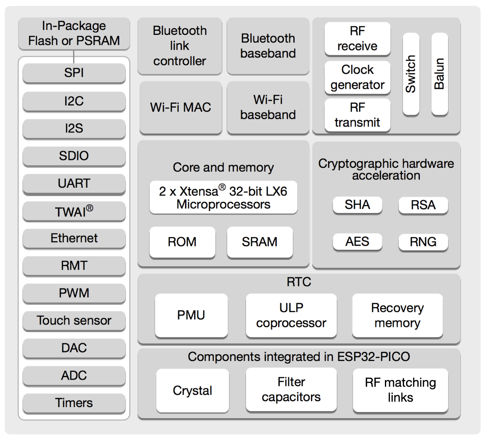

# CPU Scheduling

ESP32-PICO-D4 Block Diagram:


The ESP32-PICO-D4 includes 2x Xtensa 32-bit LX6 Cores and 1x ULP Coprocessor. There are 2 ways to run code on the ESP32, either on the main cores or on the ULP coprocessor. The ULP coprocessor is a low power coprocessor that can run code while the main cores are in deep sleep. 

The ULP coprocessor is not used in this project, but it is possible to use it to run code that needs to run while the main cores are in deep sleep.

The ESP32's 2 cores are both used, Core#0 is used for wireless communications and background tasks, while Core#1 is used for the real time task and only the real time task. 

Every time a program cycle is completed, a sync semaphore is is given to BackgroundTask to run. **Therefore BackgroundTask will at most match the refresh** rate of RealTCode, but sometimes BackgroundTask might hang while some non-async code is running and locking up that thread, but that is fine because RealTCode will keep running and keep the UI responsive while the poop code finishes running. 

Core #1 should not be interrupted by anything else and there is no need to 'yield();' to other tasks in Core#1. **Failure to complete a RealTcode program cycle in time will lock up the BackgroundTask thread, since it is waiting for a sync semaphore to be given by RealTCode, and the LCD will become unresponsive and the device will freeze.**


There are 2 important Threads in this program;

RealTCode: Runs on core #1, gives the syncSemaphore when a cycle is done, 

BackgroundTask: Runs on core #0, waits until the syncSemaphore is given, then runs the code that needs to be run in the background. This thread can be used to run code that takes a long ass time to execute without locking up the system, but **'yield()' statements MUST be placed before and after code that takes a long time since core#0 is used for by other threads, and if they time out the system will crash with this error:**
```
TODO: put error
```
Wireless coms are managed by Core#0 therefore we must yield frequently to avoid starving that task of CPU time and crash the system. 


